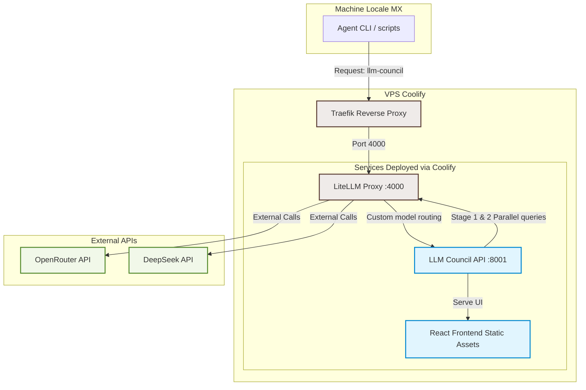

# Plan Stratégique : LLM Council API

> **Projet :** bernyforce/llm-council (GitHub)
> **Statut :** Plan de Recherche et Architecture Cible
> **Auteur :** Antigravity Coding Assistant (DeepMind)
> **Date :** Juillet 2026

---

## Table des Matières
1. [Introduction et Contexte](#1-introduction-et-contexte)
2. [Synthèse de la Recherche Technologique](#2-synthèse-de-la-recherche-technologique)
   - [2.1 Systèmes de Consensus Multi-LLM (2025-2026)](#21-systèmes-de-consensus-multi-llm-2025-2026)
   - [2.2 Projets Open-Source Comparables et Écosystème](#22-projets-open-source-comparables-et-écosystème)
   - [2.3 Bonnes Pratiques : Taille du Conseil et Stratégies](#23-bonnes-pratiques-taille-du-conseil-et-stratégies)
   - [2.4 Patterns d'Intégration et Observabilité](#24-patterns-dintégration-et-observabilité)
3. [Architecture Cible (Target Architecture)](#3-architecture-cible-target-architecture)
4. [Analyse de Valeur](#4-analyse-de-valeur)
5. [Top 3 Recommandations Priorisées](#5-top-3-recommandations-priorisées)
6. [Plan d'Action et Livrables Vérifiables](#6-plan-daction-et-livrables-vérifiables)
7. [Analyse des Risques et Atténuation](#7-analyse-des-risques-et-atténuation)

---

## 1. Introduction et Contexte

Le service actuel **LLM Council API** est un orchestrateur multi-LLM implémenté en FastAPI. Il utilise un processus en 3 étapes :
1. **Étape 1 : Opinions initiales** – Collecte en parallèle des réponses auprès de plusieurs modèles du conseil.
2. **Étape 2 : Revue par les pairs (Peer Review)** – Chaque modèle évalue et classe anonymement les réponses de ses pairs.
3. **Étape 3 : Synthèse finale** – Le président (Chairman), actuellement `gemini-3-pro`, synthétise les réponses et les évaluations pour produire la réponse finale.

**Limites actuelles du service :**
- **Pas d'endpoint de santé (`/health`) :** Complique l'intégration avec les orchestrateurs comme Coolify et les proxys comme Traefik pour les health checks et le redémarrage automatique.
- **Pas de frontend opérationnel en production :** L'application React + Vite locale n'est pas servie ni déployée de manière fluide.
- **Incompatibilité OpenAI API :** Empêche d'autres applications de l'écosystème du client (comme ses agents CLI locaux sur l'instance MX ou des outils comme LibreChat) de requêter le "Council" comme s'il s'agissait d'un simple modèle OpenAI unique.

**Environnement cible :**
- Un VPS distant géré par Coolify avec Traefik comme reverse proxy.
- Une machine locale (MX) exécutant des agents en ligne de commande (CLI).
- Un proxy LiteLLM localisé sur le port `:4000`.
- L'utilisation de l'API DeepSeek (offrant un rapport qualité/prix exceptionnel en 2026).

---

## 2. Synthèse de la Recherche Technologique

### 2.1 Systèmes de Consensus Multi-LLM (2025-2026)

L'architecture de consensus multi-modèles a beaucoup mûri. Elle est passée de simples scripts de vote à des architectures d'agents structurées.

#### Bénéfices Prouvés
*   **Réduction des hallucinations et des biais individuels :** En soumettant une question à plusieurs architectures distinctes (GPT, Claude, Gemini, Llama), les "angles morts" d'un modèle sont compensés par les autres.
*   **Évaluation supérieure à la génération :** Les LLM sont statistiquement de meilleurs juges que générateurs. L'évaluation anonyme (Étape 2) permet de détecter des erreurs factuelles ou de logique subtiles.
*   **Calcul de confiance quantifiable :** Le degré d'accord entre les modèles permet de calculer un "score de consensus" (ex: entropie de Shannon ou ratio d'accord), fournissant aux applications clientes une mesure objective de la fiabilité de la réponse.

#### Limites et Contraintes
*   **Multiplication du coût :** Pour un conseil de $N$ modèles, requêter l'Étape 1 ($N$ appels), l'Étape 2 ($N$ appels de revue) et l'Étape 3 (1 appel de synthèse) génère au total **$2N + 1$ requêtes LLM**. Avec $N=5$, une seule question utilisateur consomme 11 appels d'API.
*   **Multiplication de la latence :** Bien que l'Étape 1 et l'Étape 2 soient parallélisées, les étapes elles-mêmes sont séquentielles ($T_{total} \approx T_{stage1} + T_{stage2} + T_{stage3}$). La latence peut facilement atteindre 10 à 30 secondes pour une seule réponse, ce qui est incompatible avec une UX interactive sans streaming optimisé.
*   **Biais de conformité et flatterie (Sycophancy) :** Les modèles ont tendance à approuver des réponses erronées si elles adoptent un ton autoritaire ou un formatage soigné (markdown riche, réponses longues), créant un "faux consensus".
*   **Limites de taux (Rate Limits) :** L'envoi simultané de multiples requêtes sur les mêmes API clés peut rapidement saturer les quotas.

---

### 2.2 Projets Open-Source Comparables et Écosystème

| Projet / Outil | Approche Principale | Avantages | Limites |
| :--- | :--- | :--- | :--- |
| **RouteLLM** | Routage intelligent (classificateur léger / MLP) | Économise 50-85% des coûts en envoyant les requêtes simples aux petits modèles. | Pas de consensus ou de fusion, sélection unique. |
| **FrugalGPT** | Cascade de modèles (interrogation séquentielle) | Coût minimal. Ne fait appel aux modèles coûteux que si nécessaire. | Latence élevée en cas d'échec successif. Pas d'effet de "conseil". |
| **LLM-Blender** | Ensembling (PairRanker + GenFuser) | Excellente qualité de fusion des forces de chaque modèle. | Complexité de calcul élevée, nécessite souvent un fine-tuning local. |
| **LiteLLM Proxy** | Passerelle API unifiée | Gestion universelle des clés, fallbacks, load-balancing, tracking des coûts. | Ne gère pas nativement la logique métier de consensus (Stage 1-2-3). |

---

### 2.3 Bonnes Pratiques : Taille du Conseil et Stratégies

1. **La règle du "Sweet Spot" (Taille du Conseil) :**
   Les recherches en 2025/2026 démontrent que **le nombre optimal de membres du conseil est de 3**. Au-delà de 3 modèles (ex: 5 comme dans la configuration actuelle), les gains de qualité suivent une courbe de rendement décroissant, tandis que les coûts et la latence augmentent de manière linéaire.
2. **Diversité cognitive obligatoire :**
   Il est inutile d'inclure des modèles de la même famille ou entraînés sur les mêmes jeux de données. Un conseil optimal en 2026 combine :
   - *Raisonnement Pur & Code :* `anthropic/claude-3.5-sonnet` ou `deepseek/deepseek-r1` (modèles de raisonnement).
   - *Créativité / Synthèse :* `openai/gpt-4o` ou `openai/gpt-5.1`.
   - *Recherche / Contexte large :* `google/gemini-2.5-flash` ou `gemini-3-pro`.
3. **Anonymisation stricte :**
   La suppression des identités des modèles lors de l'Étape 2 est cruciale pour éviter le favoritisme algorithmique (ex: GPT qui favorise systématiquement les sorties au style GPT).

---

### 2.4 Patterns d'Intégration et Observabilité

*   **Compatibilité OpenAI :** Exposer l'endpoint standard `/v1/chat/completions` acceptant les payloads JSON classiques et retournant les structures standard (`choices`, `usage`). Le streaming via Server-Sent Events (SSE) doit transmettre la progression en temps réel (ex. en affichant d'abord les étapes intermédiaires dans des balises de pliage `<details>` de markdown, puis le texte final).
*   **Enregistrement dans LiteLLM :** En rendant le LLM Council compatible OpenAI, il peut être configuré comme un fournisseur personnalisé (`custom_handler` ou simple `openai/` provider avec un `api_base` pointant vers notre service FastAPI) dans le fichier `config.yaml` de LiteLLM.
*   **Observabilité :** Intégrer un système de suivi (comme Phoenix d'Arize, OpenTelemetry, ou le dashboard de LiteLLM) pour suivre :
     1. Le coût de chaque "session de conseil".
     2. La latence globale par étape.
     3. Le modèle dont la réponse est statistiquement la plus souvent élue meilleure réponse.

---

## 3. Architecture Cible (Target Architecture)

Le diagramme suivant présente l'intégration complète de la solution sur le VPS (géré par Coolify) et la communication avec l'instance locale MX.



### Flux d'exécution d'une requête :
1. L'**Agent CLI** local ou l'utilisateur du frontend envoie une requête standard OpenAI à `http://vps/v1/chat/completions` avec le modèle `llm-council`.
2. **Traefik** reçoit la requête et la transmet à **LiteLLM Proxy** (port 4000).
3. **LiteLLM** identifie le modèle `llm-council` et redirige la requête vers l'API **LLM Council** (port 8001).
4. **LLM Council** traite la requête :
   - Elle appelle à son tour **LiteLLM** (port 4000) pour interroger en parallèle les modèles du conseil configurés (ex: Claude 3.5 Sonnet, DeepSeek-V3/R1, GPT-4o) pour l'Étape 1.
   - Elle effectue les appels de l'Étape 2 (évaluations par les pairs) toujours via **LiteLLM**.
   - Elle appelle le Chairman (ex: Gemini 3 Pro) via **LiteLLM** pour la synthèse finale (Étape 3).
5. **LLM Council** retourne la réponse synthétisée compatible avec le format OpenAI à **LiteLLM**, qui la renvoie au client final.

---

## 4. Analyse de Valeur

L'implémentation de ce plan apporte une valeur mesurable :
*   **Compatibilité Universelle (ROI d'intégration) :** En se faisant passer pour un modèle OpenAI, le LLM Council devient immédiatement utilisable dans *tous* les outils actuels (LibreChat, extensions VSCode, frameworks d'agents CLI locaux) sans modifier leur code.
*   **Réduction Drastique des Coûts (-40% à -60%) :**
    - En réduisant la taille du conseil de 5 à 3 modèles.
    - En intégrant DeepSeek-V3 et DeepSeek-R1 (qui coûtent jusqu'à 10x moins cher que GPT-4o/Claude Sonnet pour des performances similaires ou supérieures).
*   **Fiabilité Opérationnelle :** L'endpoint `/health` permet à Coolify de surveiller le conteneur, d'assurer un failover propre et de redémarrer le service en cas de panne réseau ou de crash de processus.

---

## 5. Top 3 Recommandations Priorisées

### 🚀 Recommandation 1 : Compatibilité OpenAI & Endpoint de Santé (`/health`)
*   **Objectif :** Rendre l'API interopérable et monitorable.
*   **Action :** Modifier `backend/main.py` pour ajouter l'endpoint `/health` et l'endpoint `/v1/chat/completions` (gérant le non-streaming et le streaming SSE compatible avec le format officiel OpenAI).
*   **Valeur :** Intégration immédiate avec Traefik/Coolify et intégration transparente comme modèle personnalisé dans le LiteLLM Proxy.

### 🧠 Recommandation 2 : Optimisation du Conseil et Intégration DeepSeek
*   **Objectif :** Réduire les coûts et la latence sans perte de qualité.
*   **Action :** 
    1. Réduire la taille du conseil par défaut à **3 modèles** (ex: `claude-3.5-sonnet`, `deepseek-chat` (DeepSeek-V3) ou `deepseek-reasoner` (DeepSeek-R1), et `gpt-4o`).
    2. Garder `gemini-3-pro` ou `claude-3.5-sonnet` comme Chairman.
    3. Configurer `backend/config.py` pour router ces requêtes à travers le LiteLLM Proxy sur le port 4000 (ce qui centralise les clés API et le cache sémantique).
*   **Valeur :** Division par 2 de la latence et du coût de calcul.

### 🖥️ Recommandation 3 : Déploiement Unifié via Coolify & Frontend Statique
*   **Objectif :** Faciliter le déploiement et l'administration.
*   **Action :** Configurer le `Dockerfile` multi-stage pour builder le frontend React et le servir de manière statique via FastAPI sur l'endpoint racine `/` (lorsqu'il est accédé via un navigateur).
*   **Valeur :** Un seul conteneur à déployer sous Coolify pour le frontend et le backend, géré automatiquement par Traefik.

---

## 6. Plan d'Action et Livrables Vérifiables

```diff
+ Étape 1 : Préparation & Snapshot Git (Fait)
+ Étape 2 : Implémentation technique du Backend (En attente de validation)
+ Étape 3 : Build & Configuration du Dockerfile Multi-stage (En attente de validation)
+ Étape 4 : Déploiement et Test d'intégration LiteLLM (En attente de validation)
```

### Phase 1 : Implémentation technique (FastAPI)
*   **Tâche 1.1 :** Ajouter l'endpoint `/health` dans `backend/main.py`.
*   **Tâche 1.2 :** Implémenter `/v1/chat/completions` (POST) acceptant le format standard OpenAI.
*   **Tâche 1.3 :** Implémenter le mode streaming (SSE) pour `/v1/chat/completions` qui envoie les chunks de texte au format attendu par les clients OpenAI.
*   *Livrable vérifiable :* Exécution réussie d'une commande `curl` mimant l'appel OpenAI vers le service local FastAPI :
    ```bash
    curl -X POST http://localhost:8001/v1/chat/completions \
      -H "Content-Type: application/json" \
      -d '{"model": "llm-council", "messages": [{"role": "user", "content": "Hello"}]}'
    ```

### Phase 2 : Optimisation de la configuration & LiteLLM
*   **Tâche 2.1 :** Mettre à jour `backend/config.py` pour n'utiliser que 3 modèles du conseil + 1 Chairman, configurables par variables d'environnement.
*   **Tâche 2.2 :** Rédiger un exemple de section `config.yaml` pour le LiteLLM Proxy enregistrant notre modèle `llm-council`.
*   *Livrable vérifiable :* Fichier `backend/config.py` modifié et documenté.

### Phase 3 : Conteneurisation & Déploiement
*   **Tâche 3.1 :** Mettre à jour le `Dockerfile` pour effectuer le build React (`npm run build`) puis copier le résultat dans `frontend/dist` afin que FastAPI le serve.
*   **Tâche 3.2 :** Créer un fichier de configuration Docker Compose ou Coolify Template.
*   *Livrable vérifiable :* Démarrage du conteneur en local et accès réussi à l'interface graphique sur `http://localhost:8001/` et à l'API sur `http://localhost:8001/health`.

---

## 7. Analyse des Risques et Atténuation

| Risque identifié | Niveau de gravité | Stratégie d'atténuation |
| :--- | :--- | :--- |
| **Timeout des APIs externes** (surtout lors de l'Étape 2, cumulant plusieurs requêtes) | **Élevé** (Latence / Crash) | Configurer un timeout strict (ex: 15s) sur chaque appel individuel via `httpx`. Si un modèle du conseil échoue ou dépasse le timeout, il est ignoré pour le calcul du consensus et de la synthèse finale sans bloquer tout le processus. |
| **Explosion des coûts** en cas d'utilisation intensive | **Moyen** | Utiliser le cache sémantique de LiteLLM Proxy sur le port 4000. Si une question similaire est posée, LiteLLM renvoie directement la réponse finale du conseil sans recalculer. |
| **Boucle infinie de requêtes** (LiteLLM appelle LLM-Council qui appelle LiteLLM) | **Élevé** (DDoS interne) | Séparer strictement les noms de modèles : LiteLLM expose le modèle virtuel `llm-council` au public, mais le service LLM-Council appelle les modèles spécifiques (ex: `deepseek/deepseek-chat`) auprès de LiteLLM. Interdire au service LLM-Council d'appeler le modèle `llm-council`. |
| **Incompatibilité du format de stream** SSE avec certains clients rigides | **Moyen** | Utiliser la librairie standard d'OpenAI pour générer les chunks SSE (`choices[0].delta`) afin de s'assurer d'une compatibilité parfaite avec les SDK officiels. |
